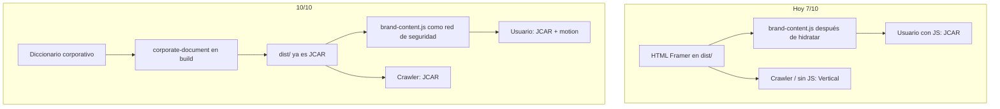

# Plan 10/10 — JCAR Labs Inc. website

| Campo | Valor |
|---|---|
| Estado | Listo para implementar |
| Fecha | 2026-09-10 |
| Partida | 7.5/10 vitrina · 7/10 corporativo (ola 1 hecha) |
| Meta | 10/10 como **sitio corporativo publicable** |
| Fuera de meta | Lighthouse 100, reescribir Framer en React, CRM |

---

## Qué significa 10/10 aquí

Este repo no es un front hecho a mano: es un export de Framer + overlay JCAR. Un 10/10 de “framework nativo” exigiría tirar Framer. Ese no es el objetivo.

**10/10 = un crawler, un cliente y una revisión de seguridad ven solo JCAR Labs.**

| Criterio | 10/10 exige | No exige |
|---|---|---|
| Marca | View-source y navegador sin JS: cero Vertical / Adam Knoxville / `vertical.framer.media` | Rediseñar el motion |
| URLs | Toda URL pública es JCAR o 301 a JCAR; ningún HTML de arte en `dist/` | Conservar slugs del template |
| SEO | Canonical, OG, JSON-LD, sitemap, robots, `lang="es"` coherentes con `jcarlabs.com` | Blog propio |
| Seguridad | Ranges acotados, traversal cerrado, lockfile, headers, shim URL también en Vercel | CSP sin `unsafe-eval` (Framer lo necesita) |
| Paridad | `astro dev`, `pnpm start` y Vercel se comportan igual | Servidor Node en producción |
| Calidad | `pnpm test` verde en Windows; tests sobre HTML transformado y redirects | Cobertura 100 % del JS de Framer |
| Contacto | WhatsApp + email visibles y el form no pierde el mensaje | Backend de leads |
| Perf | No generar páginas muertas; cache correcta | 111 fuentes recortadas a mano (riesgo visual) |

La ola 1 ya cubrió dominio, 301 de arte, copy del servicio 05, fotos, ranges, lockfile y README. Lo que baja el score es: **HTML de build todavía del template**, **shim URL solo en Node**, **3 work legacy aún compilados**, **slug SUNAT**, **tests no verificados en Windows**.



---

## Decisiones

1. **No se tira Framer.** El motion y los breakpoints siguen siendo del export.
2. **Copy corporativo entra en el HTML de build**, no solo en el cliente. Incluye texto visible **y** strings dentro de `data-framer-hydrate-v2` para que la hidratación no restaure inglés.
3. **`brand-content.js` se queda** como red de seguridad post-hydrate (FOUC residual).
4. **Slug del servicio 05:** `/services/auditoria-de-codigo` con 301 desde `/services/integraciones-sunat` (confirmado 2026-09-10).
5. **Shim `URL` en el HTML de build**, no solo en `http.mjs` / middleware de dev. Vercel es estático.
6. **WhatsApp sigue siendo el CTA.** Email ya existe. Un CRM no suma al 10/10 de marca.
7. **No se recortan las 111 fuentes en esta ola.** Riesgo de glifos rotos vs ganancia menor que el HTML de Framer.
8. **CSP conserva `unsafe-inline` / `unsafe-eval`.** Documentado; no se finge un CSP estricto.

---

## Huecos → PRs

### PR A — Paridad de producción (shim URL + bundle CMS)

**Por qué baja el score:** en Vercel el HTML estático no recibe el shim; `new URL('/x')` puede romper Framer solo en prod. La Lambda de CMS importa `src/lib/framer-ranges.mjs` sin `includeFiles`.

**Archivos:** `src/lib/corporate-document.mjs`, `src/lib/url-shim.js`, `vercel.json`, `src/lib/corporate-document.test.mjs`

- Insertar `urlShimScript` al inicio de `<head>` en **todas** las rutas (incluido 404).
- Dejar de inyectarlo en `http.mjs` / middleware **o** inyectar de forma idempotente (`data-jcar-url-shim`) para no duplicar en `pnpm start`.
- `vercel.json` → `functions["api/framercms.js"].includeFiles` incluye `src/lib/framer-ranges.mjs` (además de `dist/assets/cms/**`).
- Test: el HTML transformado contiene `class extends OriginalURL` y no lo duplica al pasar dos veces.

**Criterio:** view-source de `/` en un `astro build` (sin `serve.mjs`) incluye el shim.

### PR B — Cero HTML de rutas redirigidas

**Archivos:** `src/content/routes.json`, tests.

Quitar de `routes.json` (ya tienen 301):

- `/work/still-pressure`
- `/work/surface-tension`
- `/work/unstable-sequence`

Los HTML fuente pueden quedar en `src/content/pages/` por si se reexporta Framer; **no** deben salir en `dist/`.

**Criterio:** `dist/work/` solo contiene `index.html`, `sistema-hotelero`, `nezus-bisuteria`, `soluciones-empresariales`. `curl -I` de los slugs viejos sigue en 301.

### PR C — Una sola tabla de redirects

**Archivos:** `src/lib/legacy-redirects.mjs` (nuevo), `src/middleware.ts`, `src/server/http.mjs`, `src/lib/legacy-redirects.test.mjs`

```js
export const LEGACY_REDIRECTS = new Map([
  ['/thoughts', '/services'],
  ['/work/unstable-sequence', '/work/sistema-hotelero'],
  ['/work/still-pressure', '/work/nezus-bisuteria'],
  ['/work/surface-tension', '/work/soluciones-empresariales'],
  ['/work/fragile-perfection', '/work'],
  ['/work/silent-gravity', '/work'],
  ['/services/integraciones-sunat', '/services/auditoria-de-codigo'], // PR D
]);
export const LEGACY_PREFIXES = [{ prefix: '/thoughts/', target: '/services' }];
```

Middleware y `http.mjs` importan esto. `vercel.json` no se genera (JSON a mano), pero el test lee `vercel.json` y falla si falta algún par del Map.

**Criterio:** añadir un 301 en el Map y olvidar Vercel hace fallar `pnpm test`.

### PR D — Slug `/services/auditoria-de-codigo`

**Archivos:** `src/content/corporate.mjs`, `src/content/routes.json`, `src/content/brand-content.base.js`, `scripts/lib/corporate-assets.mjs`, redirects (PR C), carpeta `src/content/pages/services/`.

- Ruta canónica nueva. El archivo HTML puede seguir siendo el de `integraciones-sunat` mapeado en `routes.json`.
- 301 permanente del slug SUNAT.
- Sitemap, listados, `detailPages`, `href` internos.
- `hideUnconfirmedCards` no aplica; sí actualizar cualquier link hardcodeado.

**Criterio:** `/services/integraciones-sunat` → 301. `/services/auditoria-de-codigo` 200, title de auditoría, sitemap sin el slug viejo.

### PR E — Copy JCAR en el HTML de build (el salto a 10/10)

**Archivos:** `src/lib/corporate-document.mjs` (o `src/lib/corporate-html.mjs`), `src/content/corporate.mjs`, tests sobre fixtures y, si es barato, sobre `dist/` tras build.

Hoy el build solo parchea `<head>`. El `<body>` del export sigue en inglés / Vertical hasta que corre `brand-content.js`.

**Enfoque (no Playwright):**

1. Construir un diccionario único: `sharedCopy` + `extraCopy` + replacements de `brand-content.base.js` (las claves ya normalizadas en mayúsculas).
2. Con parse5 (`sourceCodeLocationInfo` ya se usa en `documents.ts`):
   - Recorrer nodos de texto en `body` (no `script`, no `style`).
   - Si `normalized(text)` está en el diccionario, sustituir conservando espacios de borde.
   - No tocar atributos `class`, `data-framer-*`, `href` de rutas vivas.
3. En atributos `data-framer-hydrate-v2` (JSON): recorrer strings y aplicar el mismo diccionario. Así la hidratación no vuelve a “Adam Knoxville”.
4. Reemplazar `https://vertical.framer.media` restante por `site.origin` en href/src de head/body que no se hayan limpiado.
5. `lang="en"` → `lang="es"` si el documento no es ya `es`.
6. Quitar o reescribir `<meta name="generator" content="Framer …">`.
7. Lista negra de tests (fallan el build si aparecen en el HTML transformado de `/`, `/contact`, `/work`, `/services`):

```
Adam Knoxville
VERTICAL BY
vertical.framer.media
hey@adamknoxville
(44) 7700 900 482
Fragile Perfection
Silent Gravity
```

**Riesgo:** hidratación Framer. Mitigación: cambiar también el JSON de hydrate (paso 3) + overlay cliente. Si un bloque no está en el diccionario, el overlay lo sigue cubriendo.

**Criterio:** `pnpm build` y `rg -i "adam knoxville|vertical.framer.media" dist -g "*.html"` → 0. Abrir `/` con JS desactivado: marca JCAR, no Vertical.

### PR F — Tests Windows + aceptación

**Archivos:** `scripts/run-tests.mjs` (ya existe), `src/lib/*.test.mjs`, opcional test de `createSiteServer` con 301.

- `pnpm test` usa el runner que lista `*.test.mjs` (no pases directorios a `node --test` en Windows).
- Tests de PRs A–E.
- Test de servidor: `createSiteServer` sobre un dir temporal; `GET /work/fragile-perfection` → 301 `/work`.
- Checklist manual (no automatizar Playwright en esta ola salvo que A–E pasen y quede tiempo):

  1. `pnpm test`  
  2. `pnpm run build`  
  3. `pnpm start`  
  4. `curl.exe -I` thoughts, fragile-perfection, silent-gravity, still-pressure, integraciones-sunat  
  5. View-source `/` y `/contact`  
  6. Chrome: `/`, `/services`, `/services/auditoria-de-codigo`, `/work`, `/contact`, `/#about-me` — desktop y 390px  
  7. Misma pasada con JS off (DevTools)

**Criterio de cierre 10/10:** checklist en verde y grep de `dist/*.html` limpio.

---

## Orden de merge

```
A (paridad) → B (no generar HTML muerto) → C (tabla redirects) → D (slug) → E (copy de build) → F (tests + verificación)
```

D depende de C si el 301 SUNAT vive en el Map compartido; se puede hacer C con el par SUNAT ya incluido y D solo mueve ruta/copy/sitemap.

E es el PR más grande y el único que cambia el score de verdad. A–D son higiene; sin E el crawler sigue viendo el template.

## Rollout

1. Preview Vercel de A–D (bajo riesgo).  
2. Preview de E: revisar hidratación (consola, flash de texto, cards de servicios). Si Framer pisa el copy, ampliar el diccionario o el walk del JSON hydrate — no revertir A–D.  
3. Producción cuando F esté verde.  
4. Rollback de E: revertir `corporate-document.mjs`; el overlay cliente sigue cubriendo usuarios con JS.

## Riesgos

| Riesgo | Severidad | Mitigación |
|---|---|---|
| Hidratación Framer restaura inglés | alta | Reemplazo dentro de `data-framer-hydrate-v2`; overlay; lista negra en CI |
| Diccionario incompleto (una frase del export no mapeada) | media | Test de lista negra + ampliar mapa; no bloquear el merge por una frase si no es marca (Knoxville / Vertical / Framer URL sí bloquean) |
| 301 del slug SUNAT pierde un backlink | baja | 301 permanente; sitemap nuevo |
| `includeFiles` mal puesto infla la Lambda | baja | Solo el `.mjs` de ranges, no todo `src/` |
| Recortar fuentes “para el 10” rompe glifos | alta | Fuera de alcance a propósito |

## Open questions

Ninguna. Confirmado el 2026-09-10: el slug SUNAT se renombra a `/services/auditoria-de-codigo` con 301.

## PR Plan (resumen)

| # | Título | Archivos principales | Depende de |
|---|---|---|---|
| A | Shim URL en HTML de build + includeFiles CMS | `corporate-document.mjs`, `url-shim.js`, `vercel.json` | — |
| B | No generar work legacy | `routes.json` | — |
| C | Tabla única de 301 + test vs vercel.json | `legacy-redirects.mjs`, middleware, `http.mjs` | — |
| D | Slug `/services/auditoria-de-codigo` + 301 | `corporate.mjs`, routes, brand-content, sitemap | C |
| E | Diccionario corporativo en body + hydrate JSON | `corporate-document.mjs`, tests lista negra | A |
| F | Tests Windows, 301 en servidor, checklist | `run-tests.mjs`, `*.test.mjs` | A–E |
