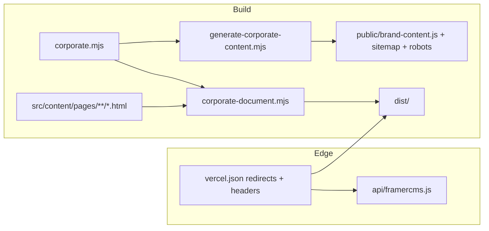

# Plan de correcciones — JCAR Labs Inc. website

| Campo | Valor |
|---|---|
| Estado | Listo para implementar |
| Fecha | 2026-09-10 |
| Alcance | Remediar hallazgos de la auditoría: marca, SEO, seguridad, ops |
| Fuera de alcance | Reescribir el sitio fuera de Framer, CRM, analítica nueva |

---

## Overview

El sitio es un export de Framer servido como SSG Astro, con copy corporativo aplicado en el cliente (`brand-content.js`) y metadatos parcheados en el build (`corporate-document.mjs`). El visual funciona. Lo que impide publicarlo como sitio corporativo es: URLs del template aún vivas, SEO sin dominio, el servicio 05 desalineado, fotos ajenas como “equipo”, y un par de huecos de seguridad/ops.

Este plan no cambia la arquitectura Framer+Astro. Corrige la capa corporativa, cierra superficie pública del template y endurece el transporte (Vercel + servidor local) en PRs incrementales.

## Goals

- El HTML servido no expone Vertical / Adam Knoxville / arte contemporáneo en URLs públicas.
- Canonical, sitemap, robots y JSON-LD apuntan al dominio de JCAR Labs, sin trailing slash.
- Servicio 05 (auditoría) tiene título, descripción, tags y About coherentes.
- Fotos del template dejan de usarse como equipo.
- El handler CMS no puede amplificar ranges.
- Deploy de Vercel usa lockfile congelado y typecheck.
- Cada PR es mergeable solo y verificable.

## Non-goals

- Sustituir Framer por un frontend propio.
- Mover todo el copy al HTML de build en el primer corte (alto riesgo de romper motion).
- Backend de leads / CRM.
- Banner de cookies (no hay analítica propia; se alinea la política).
- Recorte agresivo de fuentes/vídeos (ola 2, opcional).

## Decisiones

1. **Canonical sin barra final.** `vercel.json` ya tiene `trailingSlash: false`. El generador debe emitir `https://dominio/contact`, no `.../contact/`.
2. **Dominio en `site.origin`:** `https://jcarlabs.com` (confirmado).
3. **Slug `/services/integraciones-sunat` se mantiene** (confirmado). Se corrige copy/tags/About; el rename queda como follow-up de ola 2.
4. **Páginas de arte huérfanas: 301 a `/work`.** `/work/fragile-perfection` y `/work/silent-gravity`. `/thoughts/*` ya va a `/services`.
5. **Se conserva el overlay cliente** (`brand-content.js`). La ola 1 endurece metadatos de build, redirects y copy de listados. Reescribir el DOM de Framer en el servidor es ola 2.
6. **Fotos de equipo:** reemplazar retratos del template por un asset de marca propio. No inventar “equipo” con fotos de terceros.
7. **Imagen social:** still existente del hero (`/assets/images/hero-image-6.jpg`, confirmado). `site.socialImage` = `https://jcarlabs.com/assets/images/hero-image-6.jpg`.
8. **Política de privacidad:** quitar la promesa de analítica/cookies de medición hasta que exista. Conservar cookies esenciales si Framer las usa.

## Arquitectura (sin cambio de stack)



Los tres lugares de redirects deben seguir la misma tabla (hoy ya hay drift):

| Destino | `vercel.json` | `src/middleware.ts` | `src/server/http.mjs` |
|---|---|---|---|
| `/thoughts`, `/thoughts/*` → `/services` | sí | sí | sí |
| 3 proyectos legacy → slugs JCAR | sí | sí | sí |
| `fragile-perfection`, `silent-gravity` → `/work` | no | no | no |

---

## Ola 1 — publicar sin vergüenza

### PR 1 — SEO: origen, canonical, sitemap, JSON-LD

**Dependencias:** ninguna (salvo confirmar dominio).  
**Archivos:** `src/content/corporate.mjs`, `src/lib/corporate-document.mjs`, `scripts/lib/corporate-assets.mjs`.

- Activar `site.origin = 'https://jcarlabs.com'` y `site.socialImage = 'https://jcarlabs.com/assets/images/hero-image-6.jpg'`.
- Canonical y `og:url`: `${origin}${route === '/' ? '' : route}` **sin** slash final.
- `hreflang="es-PE"` con la misma URL.
- Sitemap con esas URLs; `robots.txt`:

```
User-agent: *
Allow: /
Sitemap: https://jcarlabs.com/sitemap.xml
```

- JSON-LD: no borrar `url` y dejar el objeto mudo. Sustituir `https://vertical.framer.media...` por la URL canónica del route.
- Rutas `/thoughts*` y las dos de arte: si aún se generan, `noindex, nofollow` (además del 301 del PR 2).

Criterio: `pnpm run content:generate` produce un sitemap con 14 URLs reales; el HTML de `/` y `/contact` ya no tiene `vertical.framer.media` en canonical/og:url/JSON-LD.

### PR 2 — Cerrar URLs del template

**Dependencias:** ninguna (puede ir en paralelo a PR 1).  
**Archivos:** `vercel.json`, `src/middleware.ts`, `src/server/http.mjs`, `src/content/brand-content.base.js`.

Añadir a las tres tablas de redirects (301):

```
/work/fragile-perfection  → /work
/work/silent-gravity      → /work
```

Mantener `hideUnconfirmedCards()` como red de seguridad, no como único control.

Opcional en el mismo PR: excluir `/thoughts*` y las dos rutas de arte de `src/content/routes.json` / `getStaticPaths` para no generar HTML muerto. Los 301 de Vercel no necesitan el archivo estático.

Criterio: `curl -I /work/fragile-perfection` → 301 Location `/work` en Vercel y en `pnpm start`.

### PR 3 — Servicio 05 y About alineados

**Dependencias:** ninguna.  
**Archivos:** `src/content/brand-content.base.js`, `src/content/corporate.mjs` (solo si hace falta copy), `src/lib/corporate-runtime.js` si el listado se pisa en runtime.

Hoy el generador cambia el título (`Integraciones SUNAT` → `AUDITORÍA DE CÓDIGO`) y deja la descripción/tags de facturación.

Corregir en `listingPages['/services']` item 05 y en `detailPages['/services/integraciones-sunat']`:

- description / lead: consultoría de arquitectura y auditoría de código (mismo texto que `corporate.mjs`).
- tags: `Arquitectura · Código · Seguridad · Mantenibilidad` (quitar `SUNAT · AUTOMATIZACIÓN`).
- About (`renderAboutSection`): reemplazar `INTEGRACIONES SUNAT` por `AUDITORÍA DE CÓDIGO`. Actualizar el resto de bullets si siguen el naming viejo (Desarrollo Web, Full Stack, etc.) para que coincidan con los labels de `corporate.mjs`.

Criterio: en `/services` el card 05 no menciona facturación ni SUNAT. En `/#about-me` tampoco.

### PR 4 — Quitar caras del template

**Dependencias:** ninguna.  
**Archivos:** `src/content/brand-content.base.js`, opcionalmente un asset nuevo en `public/assets/images/`.

Reemplazar `adam-knoxville.jpg`, `jane-ohara.jpg`, `matthew-spears.png`, `freja-andersson.jpg` en:

- retrato About
- avatares de `listingPages['/services']`
- fallback `currentItem?.avatar`

Usar un único asset de marca (logo o still del hero). Alt: “JCAR Labs Inc.”, no “Retrato editorial”. No borrar aún los JPG del template (pueden estar referenciados por el HTML de Framer); solo dejar de presentarlos como equipo.

Criterio: grep de esas rutas en `brand-content.base.js` = 0 usos como avatar/retrato.

### PR 5 — Seguridad y ops de deploy

**Dependencias:** ninguna.  
**Archivos:** `api/framercms.js`, `src/server/http.mjs`, `vercel.json`, `package.json`, `src/lib/corporate-document.mjs`, `src/content/brand-content.base.js`.

**Ranges CMS**

- Máximo 32 slices por request.
- Suma de bytes servidos ≤ `min(fileSize, 2_000_000)`.
- Si se excede: 416.
- Extraer `parseFramerRanges` a un módulo compartido (`src/lib/framer-ranges.mjs`) para no divergir API vs `http.mjs`.

**JSON-LD / metadata de build**

- Envolver `JSON.parse` en try/catch. Si falla, dejar el bloque original y seguir el build.

**XSS de plantillas**

- Pasar `detail.title`, `lead`, `description`, `tags` por `escapeHTML` en los `innerHTML` de detalle/listados.

**Vercel / scripts**

- `installCommand`: `pnpm install --frozen-lockfile`.
- `build:vercel`: igual que `build` (`astro check && astro build`).
- Cache JS: alinear con Vercel (`no-cache` en hashed Framer bundles es excesivo; usar `public, max-age=31536000, immutable` para `/assets/js/` y `/assets/fonts/`, y `no-cache` solo para `/brand-content.js` y `/accessibility.js`). Hoy Vercel pone `no-store` a todo JS y el servidor local pone `immutable` a `/assets/js/` — unificar.

Criterio: request con 100 ranges o con slices que sumen > 2 MB → 416. `pnpm run build:vercel` corre `astro check`.

### PR 6 — Parche de `URL` sin romper `instanceof`

**Dependencias:** ninguna.  
**Archivos:** `src/middleware.ts`, `src/server/http.mjs`.

Sustituir el constructor-función por una subclase que preserve el prototipo nativo:

```js
const OriginalURL = window.URL;
window.URL = class extends OriginalURL {
  constructor(url, base) {
    try {
      super(url, base);
    } catch (error) {
      if (base === undefined && typeof url === 'string') {
        super(url, window.location.href);
        return;
      }
      throw error;
    }
  }
};
```

Mismo snippet en middleware (dev) y `http.mjs` (preview). Extraerlo a `src/lib/url-shim.js` si se puede servir como script estático; si el shim se inyecta como string, un único template string importado.

Criterio: `new URL('/x')` no lanza; `new URL('/x', location.href) instanceof URL` es true.

### PR 7 — Tests mínimos y README honesto

**Dependencias:** PRs 1, 3, 5 (testea su comportamiento).  
**Archivos:** `package.json` (`"test": "node --test"`), `scripts/lib/*.test.mjs` o `src/lib/*.test.mjs`, `README.md`.

Cubrir con `node:test` (sin framework nuevo):

- `parseFramerRanges`: válido, overflow, demasiados slices, travessía de filename (API).
- Canonical: origin null vs origin set; sin trailing slash.
- Sitemap vacío vs lleno.
- Generador: el card 05 no contiene “SUNAT” ni “facturación”.

README: quitar la lista de React/Node/Python/Java/PHP como stack **del sitio**. Dejar: Astro 7 SSG, overlay Framer, Vercel, Node ≥ 22.12. El stack comercial de JCAR Labs vive en copy, no en `package.json`.

Criterio: `pnpm test` verde en CI local. README no afirma dependencias que no existen.

---

## Ola 2 — después de publicar (opcional)

| Ítem | Por qué esperar |
|---|---|
| Copy corporativo en el HTML de build (no solo JS) | Evita FOUC/SEO sin JS; toca el contrato visual de Framer |
| Rename `/services/integraciones-sunat` → `/services/auditoria-de-codigo` + 301 | SEO de slug; no bloquea el lanzamiento |
| Dejar de generar `/thoughts/*` | Menos HTML muerto; ya cubierto por 301 |
| Subset de fuentes (111 woff2) e imágenes no usadas | Perf; no es bloqueo de marca |
| Captura de leads (form → API o servicio) | Producto, no higiene del sitio |
| Política de cookies real + analítica | Solo si se añade medición |

## Rollout

1. Mergear PRs 1–6 en `main` (1, 2, 3, 4, 5, 6 son independientes; 7 al final).
2. Preview en Vercel: revisar `/`, `/services`, `/services/integraciones-sunat`, `/work`, `/contact`, `/privacy-policy`.
3. Pegar en el navegador (y sin JS) `/work/fragile-perfection` y una URL `/thoughts/...`.
4. View-source de `/`: no debe quedar `vertical.framer.media` en canonical/og/JSON-LD.
5. Producción: DNS + `site.origin` si no se mergeó ya con el dominio real.
6. Rollback: revertir el PR; todo es estático + redirects. El handler CMS es el único runtime.

## Riesgos

| Riesgo | Severidad | Mitigación |
|---|---|---|
| Activar origin con dominio equivocado | alta | Un campo; preview antes de prod |
| 301 de arte a `/work` rompe un enlace interno de Framer | media | Los cards ya se ocultan; el listado JCAR no los usa |
| `astro check` en Vercel falla por tipos preexistentes | media | Corregir en el mismo PR 5; no silenciar |
| Subclase `URL` sigue sin `canParse` en runtimes viejos | baja | Node 22 / browsers actuales lo tienen en el prototipo padre |
| Quitar avatares rompe layout de cards | baja | Mismo `img` con otro `src` |

## Open questions

Ninguna pendiente. Confirmado el 2026-09-10:

1. Dominio: `https://jcarlabs.com`.
2. Slug SUNAT: se mantiene; solo copy.
3. OG image: `/assets/images/hero-image-6.jpg`.

## PR Plan (resumen)

| # | Título | Archivos principales | Depende de |
|---|---|---|---|
| 1 | SEO: origin, canonical sin slash, sitemap, JSON-LD | `corporate.mjs`, `corporate-document.mjs`, `corporate-assets.mjs` | — |
| 2 | 301 de páginas de arte huérfanas | `vercel.json`, `middleware.ts`, `http.mjs` | — |
| 3 | Alinear servicio 05 y About | `brand-content.base.js` | — |
| 4 | Quitar retratos del template | `brand-content.base.js` | — |
| 5 | Limits CMS, lockfile, check, cache, escape | `framercms.js`, `http.mjs`, `vercel.json`, `package.json` | — |
| 6 | Shim `URL` como subclase | `middleware.ts`, `http.mjs` | — |
| 7 | Tests `node:test` + README | `*.test.mjs`, `README.md`, `package.json` | 1, 3, 5 |

Orden de merge sugerido: **2 → 3 → 4 → 5 → 6 → 1 → 7**. El 1 (origin) es el que toca producción pública; conviene tener redirects y copy limpios antes de indexar.
